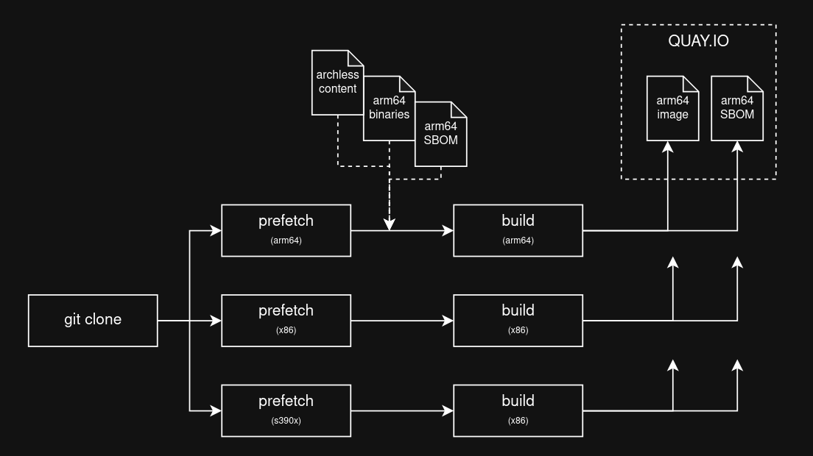
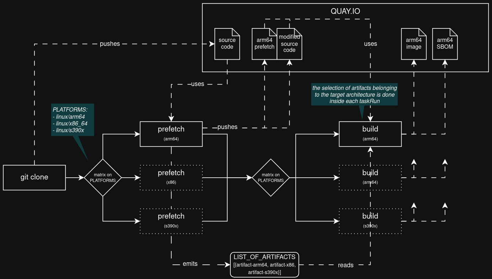

# How to produce accurate SBOMs for multi-arch pipelines?

## Problem statement

Currently, when a hermetic multi-arch build is performed, only a single prefetch task is run. This task is responsible for prefetching all the arch-specific content for all target architectures. Further down the line, the build task is executed hermetically and has access to the prefetched content. 

Unfortunately, this means that the content for all architectures is available for each of the arch-specific builds, and by consequence, all the content needs to be reported in each resulting SBOM. In other words, an x86_64 SBOM might contain packages labeled as arm64.

Note that only filtering out the content in the final SBOM is not ideal. Since all the content is available to each build, it should also be reported as so in the SBOM.

## Proposed approach

Execute the prefetch multiple times, one for each of the target architectures. This will allow the content to be precisely fetched for a single architecture, which also means producing an accurate SBOM.



**Note that the archless content will be downloaded multiple times across each prefetch task run**.

To avoid problems with remote hosts and to keep the complexity low, we will also always execute the prefetch on a x86 host, and filter the prefetched content based on the target architecture.

You can find a simplified example of the pipeline in the [.tekton](./tekton) folder of this repository. Note that the actual build is only being executed for x86_64, since what we want to validate here are only the necessary changes to pipeline and its tasks.

### Some Tekton limitations

#### Using two dependent sets of matrix task runs

There is no way to easily synchronize the output of the matrix of prefetch tasks to the input of the matrix of build tasks. Here's a few limitations we're hitting:

- Each taskRun for the prefetch task emits three distinct results: the path to the patched source code (`hermeto inject-files`), the path to the prefetched content and the platform for which the prefetch was executed. They would need to all be mapped to the same build taskRun, but there's no way to simply spawn a new taskRun using all the results from a previous taskRun. So the solution here was to have a single result as a JSON string.

- We could use the single JSON string result as a single parameter for starting the matrix of build taskRuns, but we have a limitation with the multi-arch controller that requires us to use a PLATFORM parameter with the exact strings needed to run the task in a remote host with matching architecture. So we will need to reuse the pipeline PLATFORM parameter in the build task, and filter the list of JSON results emitted from the matrix of prefetch tasks to find the result that matches the target architecture for that taskRun.



**This issue could be greatly simplified if the prefetch was made into a step inside the build task**. However, this is likely only feasible after the prefetch and build tasks are implemented in the konflux-build-cli.

#### End-user experience

Currently, the proposed solution will require the user to specify two sets of pipeline parameters: PLATFORMS and PREFETCH_INPUTS.

```yaml
- name: PLATFORMS
    value:
    - linux/x86_64
    - linux/arm64
    - linux/s390x
- name: PREFETCH_INPUTS
    value:
    - '{"platform": "linux/x86_64", "input": {"type": "pip", "binary": {"os": "manylinux", "arch": "x86_64"}}}'
    - '{"platform": "linux/arm64", "input": {"type": "pip", "binary": {"os": "manylinux", "arch": "aarch64"}}}'
    - '{"platform": "linux/s390x", "input": {"type": "pip", "binary": {"os": "manylinux", "arch": "s390x"}}}'
```

This is bad user experience:
- The prefetch input platforms need to match exactly the values from platforms, or the pipeline will fail.
- The actual filtering is also controlled by the `binary` object inside each PREFETCH_INPUT, which gives room for the user to mess it up.

**Follow up investigations**:
- Investigate the possibility of providing a more cohesive pipeline input and implement an abstraction layer to convert it into what is expected by the prefetch and build tasks.
- Alternatively, investigate the possibility of updating the multi-arch controller so it can also trigger the remote builds based on a JSON object containing the platform keyword (which would allow us to use the output of the prefetch task as the matrix PARAM for buildah-remote)

### Some problems with the multiple prefetch approach

- Fetching the same content multiple times

The prefetched content is, for most cases and in most part, architecture agnostic. In order to have the accurate prefetch done for each architecture, we need to download this content multiple times, which also means we're making the whole pipelineRun more error prone, and potentially slower.

**Follow up investigations:**
- Check how the run time is affected with adding multiple prefetch tasks
- Investigate how retries or other mechanism can be used to ensure pipeline stability
- Test the behavior on very large and complex projects
- Investigate the possibility of isolating the downloading of the archless content in a single shared taskRun.

